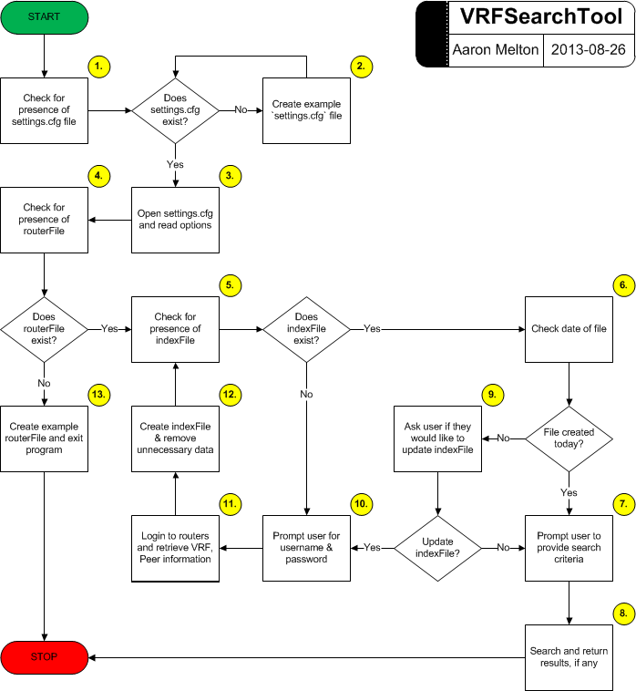

# VRFSearchTool.py #
----------

## About ##
**VRFSearchTool.py** is a Python application that allows a user to search for a VRF name and returns the hostname/router of the gateway on which it is configured.

## Dependencies ##
Exscript module [https://github.com/knipknap/exscript/](https://github.com/knipknap/exscript/)

## Requirements ##
1. This application is hard-coded to use the SSH2 protocol; If SSH v2 is not
   enabled on your router(s), you will need to:
   * Add `ip ssh version 2` to your Cisco router(s) configuration and any 
   associated access-list changes.
   or
   * Alter the `default_protocol` variable in the `get_hosts_from_file` function
   to use a different protocol enabled on your router(s).
2. A valid username/password.
3. Presence of a `routers.txt` file containing a list, one per line, of 
   Hostnames or IP Addresses of routers on which VRF tunnels are configured.
   (If one is not provided, the application will create an example file for
   the user.)
4. Presence of a `index.txt` file. The application will create this file for
   it's own use, if it does not already exist.

## Assumptions ##
1. This application was written for use on Cisco IOS devices and cannot be
   guaranteed to work on other makes/model routers.
2. This application assumes that you have enable privileges on each router
   in order to execute the `show running-config` command.  If you do not
   have sufficient user privileges, this application will not work as
   designed.

## Limitations ##
1. This application uses the same username/password to access ALL routers. If
   your routers use unique usernames/passwords, then this script will not work.

## Functionality ##

1. Upon execution, the application will search its parent directory for the
   presence of a file named `routers.txt`.
   * If this file does exist, the application will proceed to Step 2.
   * If this file does not exist, the application will proceed to Step 10.
2. The application will search its parent directory for the presence of a file
   named `index.txt`.
   * If this file does exist, the application will proceed to Step 3.
   * If this file does not exist, the application will proceed to Step 7.
3. The application will check the timestamp of the last modification made to
   the `index.txt` file.
   * If the file was created today, the application will proceed to Step 4.
   * If the file was not created today, the application will proceed to Step 6.
4. The application will ask the user to provide the search criteria; Either
   the VRF name or Peer IP Address of the VPN tunnel to locate.
5. The application will open the `index.txt` file as read-only and search 
   through the `index.txt` file and return all values found (if any)
   corresponding to the search criteria provided by the user. The application
   will then close the `index.txt` file and exit (END).
6. The application will ask the user if they would like to update the
   `index.txt` file.
   * If the user does not want to update the `index.txt` file, the application
   will proceed to Step 4.
   * If the user wants to update the `index.txt` file, the application will 
   proceed to Step 7.
7. The application will ask the user for their username and password.  These
   credentials will be used to login to each of the routers listed in the 
   `routers.txt` file.
8. The application will log in to each of the routers listed in the
   `routers.txt` file using the username and password provided by the user. 
   Using the `show run | include crypto keyring` command, the application 
   will collect all the VRFs configured on each router and write them to 
   the `index.txt.tmp` file.  
9. Removing all the unnecessary information from the `index.txt.tmp` file,
   the application will copy the VRF Name, Customer Peer IP and Local Peer IP
   (seperated by commas) into an `index.txt` file.  The application will then
   remove the temporary file, `index.txt.tmp`  Return to Step 2.
   Note: If the `index.txt` file already exists, it will be overwritten during 
   this step.
10. The application will display instructions for the use of the `routers.txt`
   file.  The application will also create an example file and place it in 
   its parent directory end exit (END).
